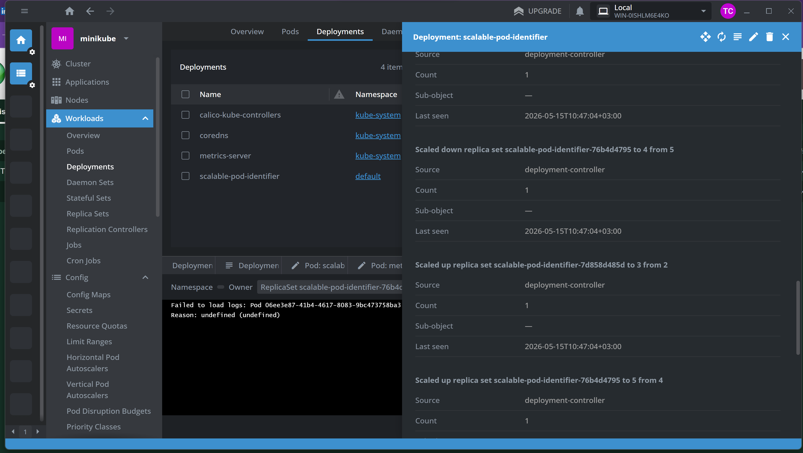

# architecture-insuretech
YandexArch. Спринт 8. Учебный проект "Архитектор InsureTech"

# Задание 1. Проектирование технологической архитектуры
Архитектура масштабирования и отказоустойчивости InsureTech
## 1. Общая архитектура

Система развёрнута в двух географически распределённых ЦОДах.

Модель:

- ЦОД 1 — Active
- ЦОД 2 — Passive 

Используются два независимых Kubernetes-кластера.
Пользовательский трафик направляется через DNS + Global Server Load Balancing (GLSB).

---
## 2. Стратегия масштабирования

### Горизонтальное масштабирование (основное)

Применяется для слоя приложения:

- Kubernetes Deployment
- ReplicaSet
- Horizontal Pod Autoscaler (HPA)

Приложение stateless и масштабируется путём увеличения количества pod'ов.

---
### Вертикальное масштабирование

Используется для PostgreSQL:

- увеличение CPU
- увеличение RAM
- масштабирование дисковой подсистемы

---
## 3. Балансировка нагрузки

Используется DNS + GLSB:

- Проводится health-check ЦОДов
- При недоступности Active ЦОДа он исключается из DNS-ответов
- Клиентский трафик направляется во второй ЦОД

---

## 4. Failover-стратегия

Используется Active-Passive модель.

### Отказ ЦОД 1:

1. GLSB фиксирует недоступность
2. DNS начинает возвращать адрес ЦОД 2
3. PostgreSQL replica в ЦОД 2 промотируется в Primary
4. Kubernetes cluster 2 начинает обслуживать трафик

Архитектура обеспечивает:

- RTO ≤ 45 минут
- RPO ≤ 15 минут

---

## 5. Конфигурация базы данных

Используется PostgreSQL:

- ЦОД 1 — Primary
- ЦОД 2 — Streaming Replica
- Асинхронная репликация

Replica постоянно получает WAL-записи и находится в актуальном состоянии.

При отказе Primary выполняется promotion replica.

---

## 6. Шардирование

Шардирование не применяется.

Обоснование:

- Объём данных ~50GB
- Нет экстремальной write-нагрузки
- Репликация обеспечивает достаточную отказоустойчивость
- Введение шардирования усложняет архитектуру без необходимости
---

## 7. Итог
Архитектура обеспечивает:

- Отказоустойчивость на уровне площадки
- Горизонтальное масштабирование приложения
- Соответствие требованиям RTO и RPO
- Минимизацию сложности эксплуатации

# Задание 2. Динамическое масштабирование контейнеров

# Задание 3. Переход на Event-Driven архитектуру

# Задание 4. Переход на Event-Driven архитектуру

# Задание 5. Проектирование GraphQL API

